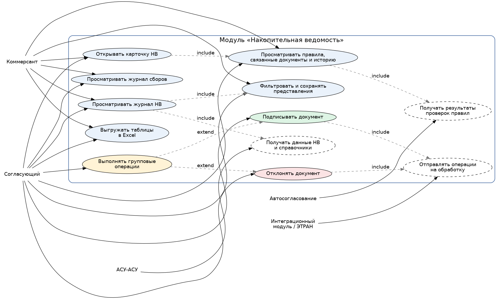

# Лабораторная работа №1

**Тема:** Формулирование требований к программной системе  
**Проект:** клиентская часть модуля «Накопительная ведомость»  
**Цель работы:** сформулировать функциональные и нефункциональные требования к проектируемой системе на основе предметной области и предполагаемых сценариев использования.

---

## 1. Перечень заинтересованных лиц (стейкхолдеров)

1. **Коммерсант**  
   Основной пользователь модуля. Работает с журналом НВ, просматривает карточку документа, анализирует результаты правил, связанные документы и историю.

2. **Согласующий**  
   Пользователь с расширенными правами. Помимо просмотра данных выполняет операции подписания и отклонения документов, в том числе массово.

3. **Руководитель подразделения / владелец процесса**  
   Заинтересован в том, чтобы процесс работы с накопительными ведомостями был прозрачным, контролируемым и не зависел от ручных Excel-таблиц и неформализованных действий.

4. **Инженер сопровождения / администратор системы**  
   Отвечает за доступность приложения, поддержку окружений, диагностику ошибок и корректное взаимодействие со смежными системами.

5. **Аналитик / архитектор решения**  
   Заинтересован в формализации требований, устойчивой архитектуре, понятной модели данных и согласованных интеграционных контрактах.

6. **АСУ-АСУ**  
   Внешняя подсистема, поставляющая нормализованные данные НВ и принимающая информацию по операциям с документами.

7. **Модуль автосогласования**  
   Поставляет данные о применении правил, на основании которых пользователь принимает решение по документу.

8. **Интеграционный модуль / ЭТРАН**  
   Обеспечивает исполнение ручных операций и возвращает результат обработки, влияющий на состояние документа.

---

## 2. Перечень функциональных требований

### 2.1. Работа с журналом НВ
- Система должна отображать журнал накопительных ведомостей в виде таблицы.
- Система должна отображать основные атрибуты НВ: идентификаторы, состояние, номер, период, дату создания, плательщика, клиента, станции, форму и место оплаты, суммы и НДС.
- Система должна отображать в журнале результаты проверки правил автосогласования.
- Система должна поддерживать поиск, сортировку и глобальную фильтрацию по полям документа и вложенным данным.
- Система должна сохранять последнее выбранное представление таблицы и повторно применять его при следующем входе в режим.
- Система должна поддерживать экспорт журнала НВ в Excel.

### 2.2. Работа с режимом «Сборы»
- Система должна отображать журнал сборов НВ в отдельном режиме.
- Система должна поддерживать фильтрацию и сортировку по дате сбора, статье начисления, суммам, налогам и связанным документам.
- Система должна открывать детализацию выбранного сбора.
- Система должна поддерживать экспорт таблицы сборов в Excel.

### 2.3. Работа с карточкой НВ
- Система должна открывать карточку НВ из журнала.
- Система должна отображать вкладки «Документ», «Правила», «Связанные документы», «История».
- Система должна отображать реквизиты документа, начисления, связанные документы, результаты правил и историю операций.
- Система должна поддерживать переход в смежные подсистемы по идентификаторам связанных сущностей, если такой переход разрешён и поддержан интеграцией.

### 2.4. Работа с операциями по документу
- Система должна позволять пользователю с ролью «Согласующий» подписывать документ.
- Система должна позволять пользователю с ролью «Согласующий» отклонять документ с выбором причины и вводом комментария.
- Система должна поддерживать групповые операции подписания и отклонения.
- Система должна блокировать повторный запуск операции над документом до завершения предыдущего запроса.
- Система должна фиксировать в истории дату, время, пользователя, операцию и результат.

### 2.5. Интеграция и обмен данными
- Система должна получать нормализованные данные НВ и справочники из смежных подсистем.
- Система должна получать данные по применению правил из модуля автосогласования.
- Система должна передавать результаты ручных операций в интеграционный модуль.
- Система должна корректно отображать успешный результат, бизнес-ошибку и техническую ошибку интеграции.
- Система должна использовать согласованные контракты обмена данными через GraphQL API и интеграционную шину.

---

## 3. Диаграмма вариантов использования

### Краткое пояснение
- **Коммерсант** работает только в сценариях просмотра и анализа информации.
- **Согласующий** имеет все сценарии коммерсанта и дополнительно выполняет операции по документам.
- **АСУ-АСУ**, **автосогласование** и **интеграционный модуль / ЭТРАН** выступают внешними участниками системы, обеспечивающими обмен данными и исполнение операций.

---

## 4. Перечень сделанных предположений

1. Модуль реализуется как внутреннее корпоративное web-приложение.
2. Аутентификация выполняется централизованно внешней корпоративной системой, а модуль НВ получает уже определённую роль пользователя.
3. Интеграции с АСУ-АСУ, автосогласованием и ЭТРАН имеют сетевую задержку и не гарантируют мгновенный ответ.
4. Операции «Подписать» и «Отклонить» доступны только в допустимых состояниях документа.
5. Справочники мест оплаты, форм оплаты, станций, причин отклонения и статей сбора поставляются смежными системами.
6. Пользователь может работать с большими таблицами, поэтому системе требуется или пагинация, или виртуализация строк.
7. Переходы в смежные системы по идентификаторам связанных документов допускаются, но могут быть введены поэтапно.
8. В первой версии приоритетом являются просмотр, фильтрация, карточка НВ и ручные операции; менее критичные сценарии можно выносить в последующие итерации.

---

## 5. Перечень нефункциональных требований

1. **Производительность**  
   Журнал НВ и журнал сборов должны открываться и обновляться без заметных задержек для пользователя даже при больших объёмах данных и сложных фильтрах.

2. **Надёжность**  
   Повторное выполнение операции над одним и тем же документом не должно приводить к дублям; пользователь всегда должен видеть актуальный результат последней операции.

3. **Безопасность**  
   Пользователь может выполнять только те действия, которые разрешены его ролью; операции изменения состояния документа должны быть недоступны ролям без соответствующих прав.

4. **Трассируемость и аудит**  
   Все пользовательские действия и результаты интеграционных операций должны быть фиксированы в истории для последующего разбора инцидентов и контроля процесса.

5. **Удобство использования**  
   Интерфейс должен поддерживать сохранение представлений, понятные статусы, предсказуемую навигацию между журналом и карточкой и минимальное число лишних шагов в основных сценариях.

### Почему выбраны именно эти нефункциональные требования
Для модуля НВ наибольшую ценность представляют не абстрактные требования к «красивому интерфейсу», а свойства, напрямую влияющие на ежедневную операционную работу: быстрый отклик, корректность состояния документа, контроль доступа, возможность аудита и удобство массовой обработки документов.

---

## 6. Вывод
В рамках лабораторной работы сформулированы основные требования к модулю «Накопительная ведомость». Полученный набор требований используется как основа для следующих лабораторных работ: проектирования архитектуры, моделирования взаимодействий, выбора структуры кода и проектирования API.
