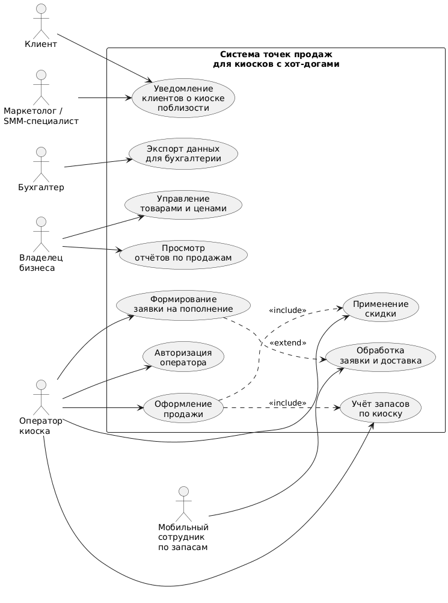

# Лабораторная работа №1

**Дисциплина:** Проектирование и архитектура программных систем  
**Тема:** Формулирование требований к программной системе

**Вариант №10:**  
Местному торговцу киосками с хот-догами нужна система точек продаж (POS) для операторов киосков с хот-догами.

---

## Цель работы

Научиться анализировать поставленную задачу и формулировать функциональные и нефункциональные требования к проектируемой системе на основе текстового описания.

---

## Перечень заинтересованных лиц (стейкхолдеров)

1. **Владелец сети киосков с хот-догами (торговец)**  
   Организует бизнес, инвестирует в разработку системы, определяет бизнес-требования, правила скидок, политику цен и ассортимент. Основной бенефициар повышения прозрачности продаж и оптимизации запасов.

2. **Операторы киосков с хот-догами**  
   Около 50 сотрудников, работающих непосредственно в киосках. Используют систему во время приготовления и продажи хот-догов, оформляют заказы, применяют скидки, фиксируют оплату. Требуют удобный и быстрый интерфейс на лёгком устройстве.

3. **Клиенты киосков**  
   Тысячи потенциальных покупателей в округе, в том числе аудитория социальных сетей. Получают информацию о ближайших работающих киосках, акциях и скидках. Взаимодействуют с системой косвенно (через уведомления и публикации в соцсетях).

4. **Мобильные сотрудники по управлению запасами**  
   Сотрудники, которые развозят продукты и расходные материалы по киоскам. Получают из системы информацию о текущих остатках и заявках на пополнение, планируют маршруты и время выезда.

5. **Бухгалтерия / финансовый отдел**  
   Используют экспортируемые данные о продажах и движении товаров для ведения бухгалтерского и налогового учёта, интеграции с системами учёта (например, 1С).

6. **Маркетолог / SMM-специалист**  
   Отвечает за продвижение киосков в социальных сетях. Настраивает правила уведомлений клиентов о работающих киосках, акциях, специальных предложениях, управляет текстами и форматами постов.

7. **Системный администратор / служба ИТ-поддержки**  
   Обеспечивает развёртывание, обновление и сопровождение системы, мониторит работоспособность, отвечает за резервное копирование и безопасность данных.

8. **Провайдеры социальных сетей (внешние сервисы)**  
   Платформы (например, VK, Telegram, Instagram\*), через API которых отправляются уведомления и сообщения клиентам. Являются внешними стейкхолдерами, от которых зависят интеграция и надёжность уведомлений.  
   \*Признана экстремистской организацией на территории РФ; использование рассматривается как технический факт интеграции.

9. **Поставщики платёжной инфраструктуры (эквайринг, онлайн-кассы)**  
   При необходимости интеграции с онлайн-кассами или терминалами обеспечивают юридически корректную фиксацию продаж. Влияют на требования к форматам данных и скорости проведения операций.

---

## Перечень функциональных требований

Ниже приведён список функциональных требований, сгруппированный по основным стейкхолдерам.

### 1. Требования со стороны владельца сети

1.1. **Управление киосками и локациями**

- Система должна позволять заводить, редактировать и архивировать киоски с указанием их местоположения (адрес, координаты, зона обслуживания).

  1.2. **Управление номенклатурой и ценами**

- Система должна поддерживать справочник товаров (виды хот-догов, добавки, напитки) с базовыми ценами и единицами измерения.
- Система должна позволять устанавливать и изменять базовые цены товаров, включая временные акции (по дням недели, времени суток, месту).

  1.3. **Управление политикой скидок**

- Система должна позволять создавать правила скидок (процентные, фиксированные, по промокодам, по времени, по виду товара).
- Система должна позволять включать/отключать отдельные правила скидок и ограничивать их по времени и месту действия.

  1.4. **Отчётность и аналитика**

- Система должна формировать отчёты по объёму продаж в разрезе киосков, периодов времени и номенклатуры.
- Система должна формировать отчёты по применённым скидкам (объём, потери выручки, доля чеков со скидками).
- Система должна предоставлять агрегированные показатели (выручка, средний чек, количество проданных единиц) за выбранный период.

### 2. Требования со стороны операторов киосков

2.1. **Авторизация и выбор точки продаж**

- Система должна обеспечивать авторизацию оператора по логину и паролю / пин-коду.
- После входа оператор должен выбрать киоск, в котором он работает, при этом система должна фиксировать геопозицию устройства для проверки.

  2.2. **Оформление продажи**

- Система должна позволять оператору собирать заказ: выбирать товары и их количество из списка, добавлять/удалять позиции в чеке.
- Система должна автоматически рассчитывать итоговую сумму чека с учётом действующих скидок и налогов (при необходимости).
- Система должна фиксировать время продажи, идентификатор оператора, киоска и местоположение.

  2.3. **Применение скидок**

- Система должна позволять применять к чеку скидки согласно заданным правилам (по промокоду, по текущей акции, по типу клиента).
- Система должна предотвращать применение скидок, не действующих для данного киоска или времени, и логировать факт применения скидки.

  2.4. **Работа со сменой**

- Система должна позволять оператору открывать и закрывать смену, фиксируя начальное и конечное состояние кассы (наличные, если учитываются).
- Система должна отображать оператору промежуточный итог по смене (количество чеков, выручка, остатки ключевых товаров).

### 3. Требования по учёту запасов и взаимодействию с мобильными сотрудниками

3.1. **Учёт остатков по киоску**

- Система должна учитывать количество ключевых продуктов (булки, сосиски, соусы и т.п.) на каждом киоске.
- При проведении продажи система должна автоматически уменьшать остатки соответствующих продуктов.

  3.2. **Формирование заявок на пополнение**

- Система должна позволять оператору создавать заявку на пополнение запасов с указанием приоритетности и желаемого времени доставки.
- Система должна автоматически формировать заявки на основе пороговых значений остатков (минимальный остаток).

  3.3. **Уведомления мобильным сотрудникам**

- Система должна отправлять мобильным сотрудникам уведомления о новых заявках на пополнение (push-уведомление или через отдельное мобильное приложение/бота).
- Система должна позволять мобильному сотруднику принимать заявку в работу и отмечать факт доставки (частично/полностью).

### 4. Требования по интеграции с социальными сетями и взаимодействию с клиентами

4.1. **Информирование о ближайших работающих киосках**

- Система должна уметь отправлять в социальные сети либо мессенджеры информацию о работающих киосках (адрес, время работы, краткое меню, акции).
- Система должна поддерживать настройку каналов уведомлений (группы/каналы в соцсетях) и частоты публикаций.

  4.2. **Гео-ориентированные уведомления**

- Система должна поддерживать отправку уведомлений клиентам, которые подписались на рассылку и находятся в радиусе заданного расстояния от работающего киоска (при наличии соответствующих возможностей у платформы).

  4.3. **Информационные кампании и акции**

- Система должна позволять планировать и запускать промо-кампании (например, «скидка 20% с 12:00 до 14:00») с автоматической публикацией анонсов.

### 5. Требования по экспорту данных для бухгалтерии

5.1. **Экспорт данных о продажах**

- Система должна позволять выгружать данные о продажах за выбранный период в формате, импортируемом в бухгалтерские системы (например, CSV, XML или форматы, совместимые с 1С).

  5.2. **Экспорт данных по номенклатуре и остаткам**

- Система должна позволять выгружать справочники товаров и текущие остатки по киоскам.

  5.3. **Настройка форматов экспорта**

- Система должна позволять администратору настраивать структуру экспортируемых файлов (выбирать поля, кодировку, разделители).

### 6. Требования по администрированию и доступам

6.1. **Управление пользователями и ролями**

- Система должна позволять создавать, блокировать и удалять учётные записи операторов, мобильных сотрудников, бухгалтера и других ролей.
- Система должна поддерживать ролевую модель доступа (оператор, бухгалтер, администратор, маркетолог).

  6.2. **Аудит действий пользователей**

- Система должна логировать ключевые действия (вход, выход, изменение цен и скидок, экспорт данных, применение ручных скидок).

---

## Диаграмма вариантов использования

Ниже приведена диаграмма вариантов использования (use case diagram), отражающая ключевые сценарии взаимодействия стейкхолдеров с системой точек продаж.

Диаграмма покрывает основные функциональные требования: оформление продаж с применением скидок, учёт запасов, заявки на пополнение, экспорт данных и уведомление клиентов.

---

## Перечень сделанных предположений

1. **Тип устройств операторов**  
   Предполагается, что операторы киосков используют современные смартфоны или лёгкие планшеты на базе Android или iOS. Ноутбуки не используются на рабочем месте из-за ограничений по месту и удобству.

2. **Постоянное (но нестабильное) сетевое подключение**  
   Предполагается наличие мобильного интернета на точках продаж. Возможны кратковременные потери связи, поэтому часть функционала (оформление продажи, учёт остатков) должна работать в офлайн-режиме с последующей синхронизацией.

3. **Способ оплаты клиентов**  
   Система в базовой версии отвечает за учёт продажи и скидок, но не реализует напрямую проведение платежей. Предполагается, что расчёт с клиентом может осуществляться наличными или через отдельный терминал эквайринга.

4. **Глубина аналитики**  
   Для оценки экономического эффекта владельцу достаточно агрегированных отчётов по выручке, количеству чеков, применённым скидкам и остаткам. Полноценная BI-система не требуется на первой итерации.

5. **Интеграция с социальными сетями**  
   Предполагается, что минимально необходимая интеграция — это возможность автоматических постов и уведомлений через официальные API соцсетей/мессенджеров (боты, группы, каналы). Персонализированная таргетированная реклама в рамках данной системы не реализуется.

6. **Бухгалтерская система заказчика**  
   Предполагается, что бухгалтерия использует распространённое решение (например, 1С), поддерживающее импорт данных из CSV или XML. Формат выгрузки можно настроить под требования бухгалтерии без изменения ядра приложения.

7. **Масштаб бизнеса в горизонте 3 лет**  
   Предполагается, что количество киосков может вырасти с десятков до нескольких сотен, при этом нагрузка на систему возрастёт постепенно. Это влияет на требования к масштабируемости и расширяемости архитектуры.

8. **Роли и права доступа**  
   Предполагается наличие базовых ролей: оператор, мобильный сотрудник по запасам, бухгалтер, маркетолог, администратор, владелец. В дальнейшем возможна детализация ролей, но для первой версии достаточно указанного набора.

---

## Перечень нефункциональных требований

Из множества возможных нефункциональных требований выделены наиболее важные и приоритетные для реализации с учётом контекста задачи.

### 1. Удобство использования на мобильных устройствах

- Интерфейс системы для операторов киосков должен быть оптимизирован под работу на смартфонах и небольших планшетах (адаптивная верстка, крупные кнопки, минимальное количество шагов для оформления продажи).
- Время оформления стандартного заказа (1–3 позиции) оператором с опытом работы должно составлять не более 10–15 секунд.
- Навигация по основным операциям (начать смену, оформить продажу, применить скидку, отправить заявку на пополнение) должна быть интуитивно понятной и не требовать специального обучения более 1 рабочего дня.

**Обоснование:** работа происходит в стеснённых условиях киоска, оператору важно не отвлекаться от приготовления еды и очереди клиентов.

### 2. Надёжность и доступность системы

- Критический функционал (оформление продаж, фиксация остатков) должен быть доступен не менее 99% времени в рабочие часы киосков.
- Система должна корректно переживать кратковременные потери связи: оформленные офлайн-продажи должны автоматически синхронизироваться с сервером при восстановлении подключения.
- Должен быть реализован механизм резервного копирования данных (не реже одного раза в сутки) и возможность восстановления данных при сбоях.

**Обоснование:** потери данных о продажах и остатках приводят к прямым финансовым потерям и конфликтам с бухгалтерией.

### 3. Масштабируемость и расширяемость

- Архитектура системы должна позволять без радикальных изменений добавить новые киоски, города и новые типы товаров.
- Должна быть возможность подключения дополнительных каналов уведомлений и новых социальных сетей через единый интерфейс интеграции (API-адаптеры/плагины).
- При росте числа киосков и операций (до нескольких сотен киосков и десятков тысяч чеков в день) система должна сохранять приемлемое время отклика (< 2 секунд на основные операции при нормальной нагрузке).

**Обоснование:** по условию задачи важнее создать решение, которое не потребует замены через 3 года, чем минимизировать бюджет первой версии.

### 4. Безопасность и контроль доступа

- Доступ к административным функциям (изменение цен, скидок, форматов экспорта, управление пользователями) должен быть строго ограничен ролями и защищён аутентификацией.
- Данные о продажах и скидках должны передаваться по защищённому каналу (HTTPS).
- Должен вестись журнал действий пользователей (аудит), позволяющий расследовать случаи мошенничества с применением скидок или несанкционированных изменений.

**Обоснование:** система влияет на денежные потоки; отсутствие контроля создаёт риски злоупотреблений со стороны персонала.

### 5. Сопровождаемость и поддерживаемость

- Код и архитектура системы должны быть организованы так, чтобы типовые изменения (добавление нового вида товара, новой скидки, нового формата экспорта) можно было реализовать без значительных доработок ядра.
- Должна быть подготовлена базовая техническая документация: описание API интеграций, структура данных, руководство администратора.
- Обновления системы (bugfix-релизы) должны устанавливаться без длительных простоев для киосков (по возможности — поэтапно или в нерабочее время).

**Обоснование:** из-за важности срока жизни решения (не менее 3 лет) критично снизить стоимость дальнейших изменений и поддержки.
