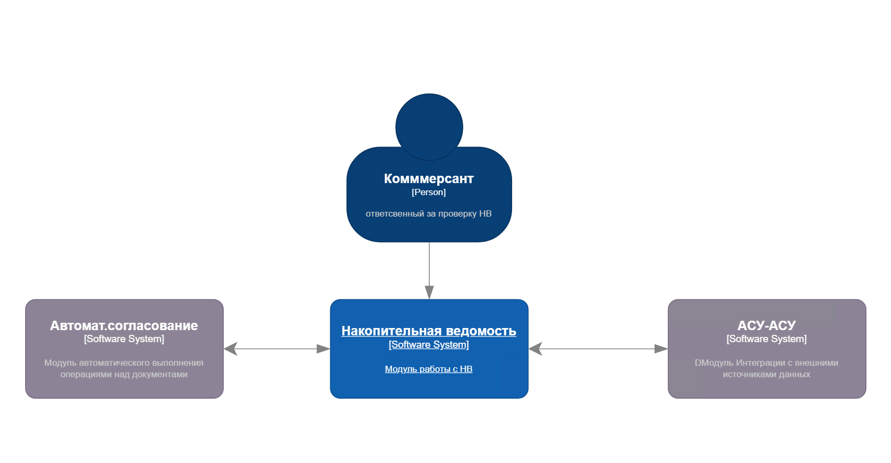
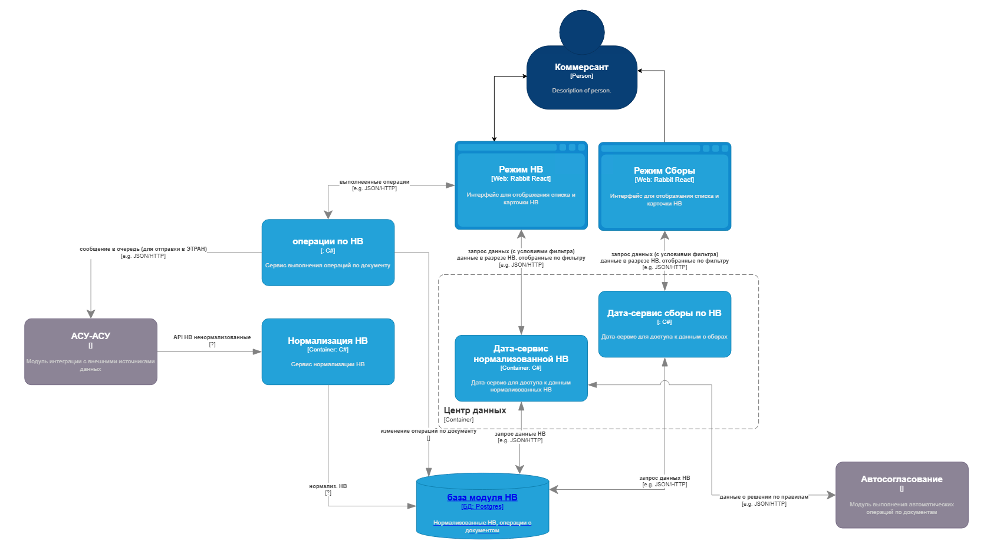
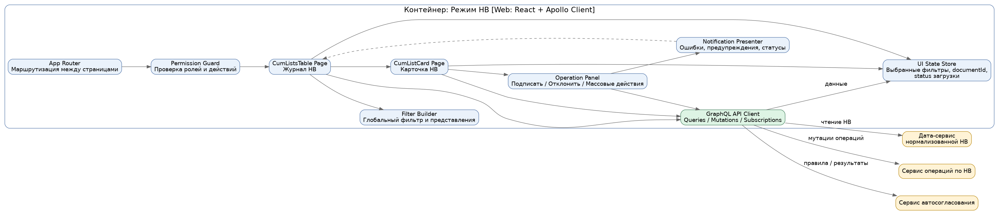
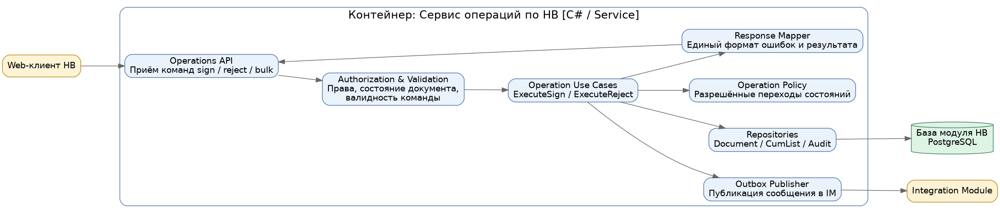

# Лабораторная работа №2

**Тема:** Использование нотации C4 model для проектирования архитектуры программной системы  
**Проект:** модуль «Накопительная ведомость»  
**Цель работы:** зафиксировать ключевые архитектурные решения на уровнях системного контекста, контейнеров и компонентов.

---

## 1. Диаграмма системного контекста

### Краткое описание основных элементов
- **Коммерсант** — основной пользователь, работающий с накопительными ведомостями.
- **Накопительная ведомость** — проектируемая программная система.
- **АСУ-АСУ** — внешний источник нормализованных данных и канал обмена операциями.
- **Автосогласование** — внешний модуль, предоставляющий результаты правил.

### Вывод по системному контексту
Система не является автономной: она встроена в корпоративный ландшафт и зависит от нескольких смежных подсистем. Поэтому архитектура должна изначально учитывать сетевые взаимодействия, устойчивость к интеграционным сбоям и разделение зон ответственности между UI, сервисами чтения и сервисами операций.

---

## 2. Диаграмма контейнеров

### Краткое описание контейнеров
- **Режим НВ** — web-интерфейс для журнала накопительных ведомостей и карточки НВ.
- **Режим Сборы** — web-интерфейс для журнала сборов и детальной информации по начислениям.
- **Операции по НВ** — сервис ручных действий над документом: подписание, отклонение, публикация результатов.
- **Нормализация НВ** — сервис преобразования входящих данных в унифицированную модель.
- **Дата-сервис нормализованной НВ** — сервис чтения журналов НВ, карточек, истории и связанных данных.
- **Дата-сервис сборы по НВ** — сервис чтения данных по сборам.
- **База модуля НВ** — централизованное хранилище документов, операций, сборов и справочников.
- **АСУ-АСУ** и **автосогласование** — внешние поставщики данных и участники обмена.
- **Коммерсант** — пользователь, работающий через web-интерфейс.

### Причины выбора архитектуры уровня приложений
В качестве базового архитектурного подхода выбрана **модульная распределённая сервисная архитектура** с разделением на web-контейнеры, сервис операций, сервисы чтения и централизованное хранилище.

Причины выбора:
1. Модуль НВ уже работает в интеграционном корпоративном контуре и не может быть спроектирован как изолированное монолитное приложение без внешних связей.
2. Сценарии чтения данных и сценарии изменения состояния документа отличаются по нагрузке, рискам и требованиям к отказоустойчивости.
3. Выделение отдельного контейнера операций упрощает контроль бизнес-правил, аудит и защиту от повторного выполнения.
4. Выделение дата-сервисов изолирует UI от прямого доступа к БД и упрощает развитие контрактов API.
5. Разделение на режимы «НВ» и «Сборы» снижает связанность интерфейса и делает архитектуру ближе к модульному frontend-подходу.

---

## 3. Диаграмма компонентов для контейнера «Режим НВ»

### Краткое описание компонентов
- **App Router** — маршрутизация между журналом НВ, карточкой документа и режимом сборов.
- **Permission Guard** — проверка ролей и доступности действий.
- **CumListsTable Page** — основной экран журнала НВ.
- **Filter Builder** — построение сложных фильтров и сохранение представлений.
- **CumListCard Page** — карточка НВ с вкладками документа, правил, истории и связанных документов.
- **Operation Panel** — запуск ручных и групповых операций.
- **UI State Store** — хранение выбранного документа, фильтров и статусов загрузки.
- **GraphQL API Client** — обращение к серверным сервисам через запросы, мутации и подписки.
- **Notification Presenter** — единый показ ошибок и статусов операций.

---

## 4. Дополнительная диаграмма компонентов для контейнера «Операции по НВ»

### Краткое описание компонентов
- **Operations API** — входная точка для команд sign, reject и bulk-операций.
- **Authorization & Validation** — проверка прав пользователя, валидности запроса и текущего состояния документа.
- **Operation Use Cases** — оркестрация бизнес-сценариев изменения состояния документа.
- **Operation Policy** — правила допустимых переходов состояний и ограничений на операции.
- **Repositories** — доступ к данным по документам, НВ и журналу аудита.
- **Outbox Publisher** — публикация сообщения для интеграционного модуля.
- **Response Mapper** — формирование единого ответа для клиента.

### Почему добавлена именно эта диаграмма
Дополнительная диаграмма компонентов нужна для повышенной сложности и даёт более полную картину архитектуры. В проекте НВ критичен не только UI, но и серверная логика ручных операций, потому что именно она отвечает за контроль прав, изменение состояния документа и взаимодействие с внешними системами.

---

## 5. Вывод
На языке C4 model архитектура модуля «Накопительная ведомость» зафиксирована на трёх уровнях:
- системный контекст;
- контейнеры;
- компоненты двух ключевых контейнеров.

Такое описание достаточно для архитектурной коммуникации и служит основой для лабораторной работы №3, где будут детализированы выбранный сценарий, последовательность взаимодействий, модель данных и принципы проектирования.
