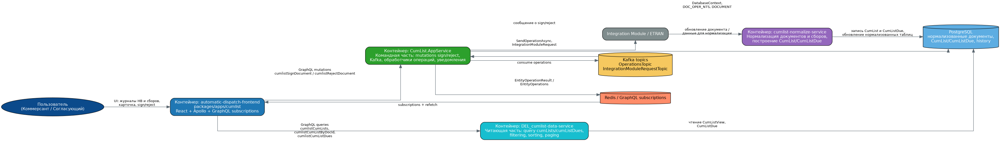
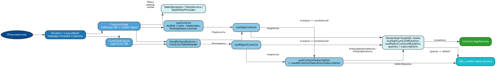
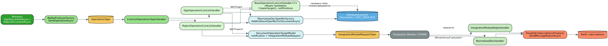
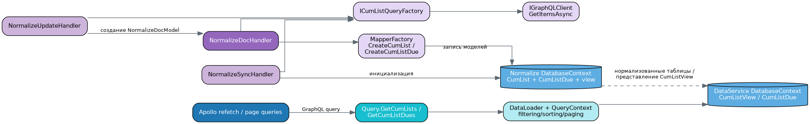
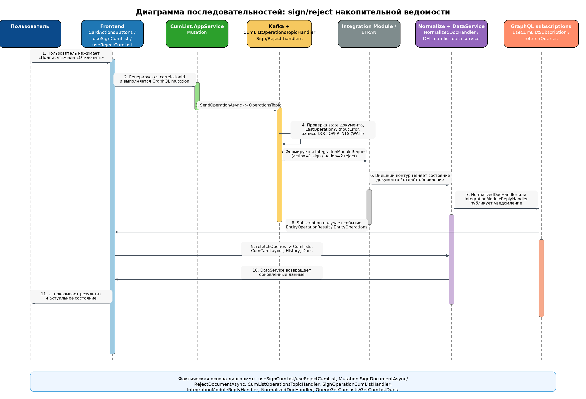
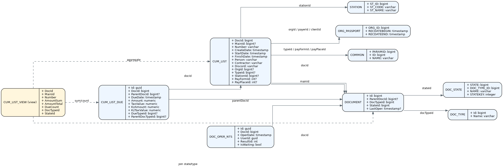
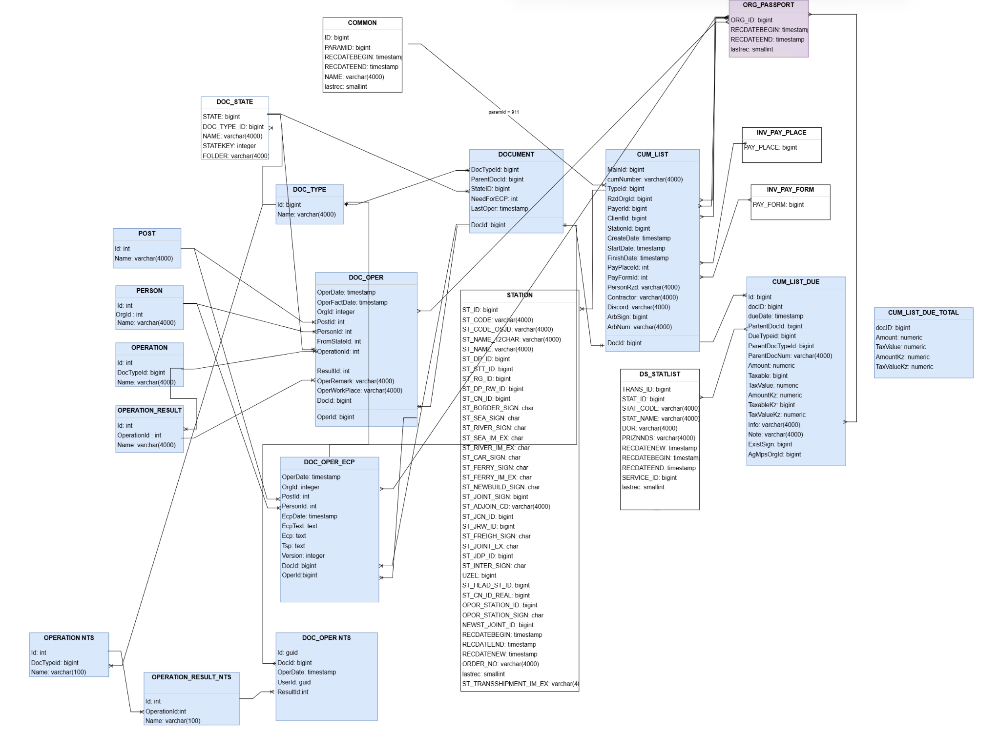
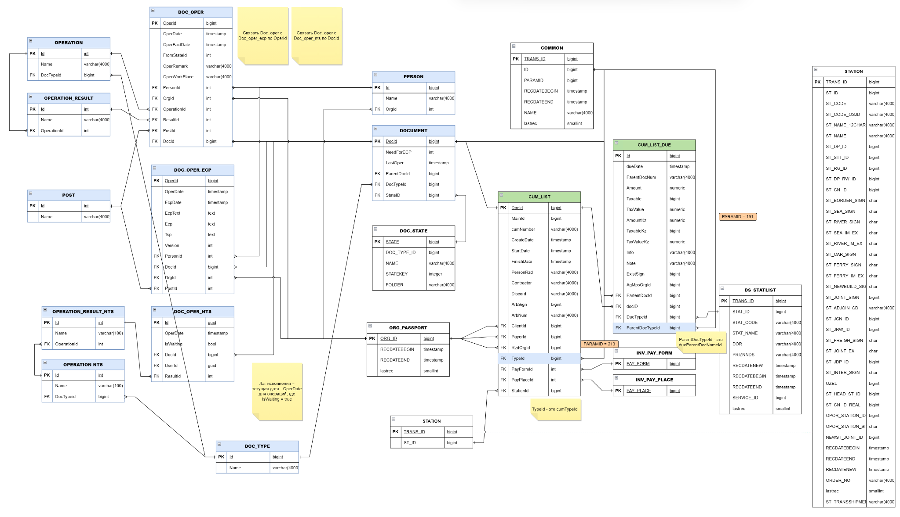

# Лабораторная работа №3

**Тема:** Использование принципов проектирования на уровне методов и классов  
**Проект:** модуль «Накопительная ведомость»  
**Основа отчёта:** реальные фрагменты из `automatic-dispatch-frontend`, `cumlist-app-service`, `cumlist-normalize-service`, `DEL_cumlist-data-service`  
**Выбранный вариант использования:** подписание и отклонение накопительной ведомости  
**Цель работы:** показать, как для реального сценария sign/reject согласованы контейнерная архитектура, взаимодействие компонентов, модель данных и программный код с учётом принципов KISS, YAGNI, DRY, SOLID и дополнительных принципов проектирования.

---

## 1. Диаграмма контейнеров

Для сценария sign/reject задействованы четыре основных контейнера:

- frontend `automatic-dispatch-frontend` (`packages/apps/cumlist`);
- командный сервис `CumList.AppService`;
- сервис нормализации `cumlist-normalize-service`;
- читающий сервис `DEL_cumlist-data-service`.

Дополнительно в контуре участвуют Kafka, Redis/GraphQL subscriptions, PostgreSQL и внешний Integration Module / ETRAN.



### Пояснение по контейнерам

1. **Frontend** показывает пользователю журнал НВ, карточку документа, кнопки операций и подписки на обновление.
2. **CumList.AppService** принимает GraphQL mutation, формирует асинхронную операцию и публикует сообщение в Kafka.
3. **Kafka + handlers** запускают обработчик sign/reject, выполняют проверки, записывают ожидание операции в историю и отправляют запрос во внешний контур.
4. **Integration Module / ETRAN** обрабатывает команду и инициирует изменение состояния документа.
5. **cumlist-normalize-service** получает обновлённый документ, заново строит нормализованные сущности `CumList` и `CumListDue`, а также обновляет агрегированное представление.
6. **DEL_cumlist-data-service** отдаёт UI актуальные данные через GraphQL query.
7. **Redis / GraphQL subscriptions** сообщает фронтенду, что состояние документа изменилось и данные нужно перечитать.

Таким образом, реальный сценарий реализован по схеме **command side + async processing + read model refresh**.

---

## 2. Диаграммы компонентов

### 2.1. Компоненты frontend-контейнера



### Краткое пояснение

Внутри frontend-контейнера для сценария sign/reject участвуют следующие компоненты:

- `Routers / LayoutRoot` — маршрутизация списка НВ, карточки и сборов;
- `CumListsPage` и `CumCardLayout` — страницы, на которых пользователь инициирует операцию;
- `CardActionsButtons` и `CumListsTableHeader` — кнопки действий;
- `useCumList` — выбор строк, переход в карточку, блокировка кнопок для недопустимых состояний;
- `useSignCumList` и `useRejectCumList` — запуск mutation и связь с подписками;
- `useCumListSubscription` и `useAllCumListOperationsSubscription` — реакция на обновления и `refetchQueries`;
- generated GraphQL hooks — фактическая интеграция с `CumList.AppService` и `DEL_cumlist-data-service`;
- `TableTemplate / DataService / TableFilterProvider` — общий слой отображения, фильтрации и табличной работы.

### Что показывает эта диаграмма

Эта диаграмма важна для демонстрации того, что даже во frontend-коде сценарий не сводится к одной кнопке. Реальная реализация разложена на:
- UI-компоненты;
- hooks управления состоянием;
- GraphQL слой;
- подписки и механизм обновления данных.

Именно такое разделение позволяет потом обосновать SoC, DRY и SOLID.

---

### 2.2. Компоненты `CumList.AppService`



### Краткое пояснение

В командном сервисе реальные компоненты сценария такие:

- `Mutation` — входная точка GraphQL-команд `cumlistSignDocument` и `cumlistRejectDocument`;
- `IKafkaProducerFactory.SendOperationAsync` — перевод синхронного GraphQL-вызова в асинхронную операцию;
- `CumListOperationsTopicHandler` — consumer и orchestration для выполнения операции;
- `SignOperationCumListHandler` и `RejectOperationCumListHandler` — сценарии sign/reject;
- `BaseCumListOperationHandler<T>` — общий шаблон проверки документа, построения уведомлений и интеграционного сообщения;
- `DatabaseContext` и `INormalizeDocOperNtsFactory` — запись истории операций (`DOC_OPER_NTS`) и проверки текущего документа;
- `DocumentOperationTargetModel` — упаковка результата операции;
- `IntegrationModuleReplyHandler` и `NormalizedDocHandler` — обработка обратного ответа и публикация уведомления;
- `IGraphQLSubscriptionsProducer` — отправка сообщений в канал подписок.

### Что показывает эта диаграмма

Диаграмма показывает, что сервис не делает sign/reject напрямую в `Mutation`.  
`Mutation` только принимает команду и отправляет её дальше, а доменная логика живёт в обработчиках. Это важное архитектурное решение для корпоративного асинхронного контура.

---

### 2.3. Компоненты нормализации и чтения



### Краткое пояснение

В этом контуре участвуют:

- `NormalizeDocHandler`, `NormalizeSyncHandler`, `NormalizeUpdateHandler` — формирование и обновление нормализованной модели;
- `ICumListQueryFactory` и `IGraphQLClient` — загрузка исходных данных;
- `MapperFactory` — преобразование внешних моделей в внутренние сущности `CumList` и `CumListDue`;
- `ViewFactory` — построение агрегированного представления `CumListView`;
- `Query.GetCumLists` и `Query.GetCumListDues` — фактические GraphQL query для UI;
- `QueryContext`, filtering/sorting/paging — поддержка фильтров и выборок.

Этот слой нужен, чтобы после sign/reject пользователь видел не «сырую» запись операции, а уже актуальное состояние карточки, истории и журналов.

---

## 3. Диаграмма последовательностей



### Пояснение по шагам сценария

1. Пользователь нажимает кнопку **«Подписать»** или **«Отклонить»**.
2. На frontend формируется `correlationId`, после чего вызывается GraphQL mutation.
3. `CumList.AppService` не выполняет логику сразу, а вызывает `SendOperationAsync` и пишет команду в Kafka.
4. `CumListOperationsTopicHandler` передаёт выполнение в `SignOperationCumListHandler` или `RejectOperationCumListHandler`.
5. Обработчик:
   - проверяет, что документ существует;
   - проверяет допустимость состояния;
   - убеждается, что предыдущая операция не находится в неразрешённом состоянии;
   - сохраняет запись `DOC_OPER_NTS` со статусом ожидания.
6. Далее формируется `IntegrationModuleRequest`, который отправляется во внешний контур.
7. После ответа / обновления документа срабатывает `IntegrationModuleReplyHandler` или `NormalizedDocHandler`.
8. В канал GraphQL subscriptions отправляется уведомление.
9. Frontend получает событие и выполняет `refetchQueries`.
10. `DEL_cumlist-data-service` возвращает актуальные данные списка НВ, карточки, истории и сборов.
11. UI показывает итог пользователю.

### Почему эта диаграмма важна

Она связывает:
- frontend hooks;
- GraphQL mutation;
- Kafka-обработку;
- запись истории операции;
- внешний интеграционный контур;
- подписки;
- повторное чтение read model.

Именно это и требовалось по заданию: показать взаимодействие компонентов для конкретного варианта использования.

---

## 4. Модель БД в виде диаграммы классов UML



### Основные сущности

- **DOCUMENT** — нормализованный документ, содержащий тип, состояние и ссылку на родительский документ.
- **CUM_LIST** — предметная сущность накопительной ведомости.
- **CUM_LIST_DUE** — сборы накопительной ведомости.
- **DOC_OPER_NTS** — история и текущее состояние операций sign/reject во внутреннем контуре.
- **DOC_STATE** — состояние документа.
- **DOC_TYPE** — тип документа.
- **STATION** — станция, связанная с ведомостью.
- **ORG_PASSPORT** — клиент, плательщик или организация.
- **COMMON** — справочник общих классификаторов.
- **CUM_LIST_VIEW** — агрегированное представление для чтения списков НВ.

### Пояснение по модели

С точки зрения реального кода важны три уровня:

1. **Командный уровень**  
   Использует `DOCUMENT` и `DOC_OPER_NTS` для проверки допустимости операции и фиксации её результата.

2. **Нормализованный уровень**  
   Представлен сущностями `CUM_LIST` и `CUM_LIST_DUE`, которые заполняются через `cumlist-normalize-service`.

3. **Read model**  
   Представлен агрегатом `CUM_LIST_VIEW`, который собирается в `ViewFactory` и используется `DEL_cumlist-data-service` для выдачи журналов и карточек.

### Дополнительные исходные схемы

Ниже приложены исходные схемы данных, на основании которых была собрана итоговая UML-модель:





---

## 5. Реализация клиентского и серверного кода с учётом KISS, YAGNI, DRY и SOLID

В папке `../src` приложены реальные фрагменты кода из проектных архивов. Ниже приведены ключевые примеры.

---

### 5.1. KISS

**Идея принципа:** решение должно быть настолько простым, насколько это возможно для текущей задачи.

#### Пример на frontend

Хук `useSignCumList` выполняет только три действия:
- создаёт `correlationId`;
- вызывает mutation;
- подписывается на результат операции.

**Файл:** `../src/frontend/shared/hooks/useSignCumList.tsx`

```tsx
export const useSignCumList = ({ onCompleted, onError }: signParams) => {
  const correlationId = useMemo(() => UUID(), []);

  const [signCumLists, { loading: mutLoading }] = useSignCumListMutation({
    fetchPolicy: 'no-cache',
  });

  const { loading } = useCumListSubscription({
    correlationId,
    onCompleted,
    onError,
    mutLoading,
  });

  useAllCumListOperationsSubscription({ onError });

  const handleCumListSign = (docId: number) => {
    void signCumLists({
      variables: {
        input: {
          correlationId,
          docId,
        },
      },
    });
  };
```

Это простая и понятная композиция. Здесь нет лишнего orchestration-слоя или «универсального движка операций».

#### Пример на backend

`Mutation` тоже остаётся предельно простой и не содержит бизнес-логики sign/reject.

**Файл:** `../src/backend/cumlist-app-service/Services/GraphQL/Mutation.cs`

```csharp
public Task<long> SignDocumentAsync(
    SignDocumentInput input,
    [Service] IHttpContextAccessor contextAccessor)
{
    return _kafkaProducerFactory.SendOperationAsync(
        configuration => configuration.OperationsTopic,
        nameof(SignDocumentAsync),
        new EntityIdOperationWith<SignDocumentInput, long, CumListOperationType>(
            input.DocId,
            CumListOperationType.Sign,
            input,
            contextAccessor.GetUserId()),
        input.DocId
    );
}
```

С точки зрения KISS это хорошее решение: mutation — только входная точка, а остальная логика уходит в асинхронный обработчик.

---

### 5.2. YAGNI

**Идея принципа:** не реализовывать то, что пока не требуется.

#### Где это видно в реальном коде

В `CumList.AppService` реализованы только **две конкретные команды**:
- `cumlistSignDocument`;
- `cumlistRejectDocument`.

**Файл:** `../src/backend/cumlist-app-service/Services/Extensions/WebApplicationBuilderExtensions.cs`

```csharp
modelsFactoryConfigure
    .AddModel<EntityIdOperationWith<SignDocumentInput, long, CumListOperationType>, SignOperationCumListHandler>(
        nameof(Mutation.SignDocumentAsync)
    )
    .AddModel<EntityIdOperationWith<RejectDocumentInput, long, CumListOperationType>, RejectOperationCumListHandler>(
        nameof(Mutation.RejectDocumentAsync)
    );
```

Что **не сделано**, и это правильно с точки зрения YAGNI:
- нет универсального «super-mutation» на все возможные операции;
- нет generic workflow-конструктора;
- нет абстракции под произвольные будущие статусы и десятки действий;
- нет преждевременной поддержки массовых сценариев, хотя в коде уже есть `TODO` на multi operation.

То есть система реализует именно то, что нужно для текущей бизнес-задачи.

---

### 5.3. DRY

**Идея принципа:** не дублировать одну и ту же логику в нескольких местах.

#### Пример 1. Общая backend-логика вынесена в базовый обработчик

**Файл:** `../src/backend/cumlist-app-service/Handlers/Core/BaseCumListOperationHandler.cs`

```csharp
protected static async Task IsAvailableOperationAsync(
    DatabaseContext context,
    long docId,
    HashSet<long>? availableStateIds,
    CancellationToken cancellationToken
)
{
    var document = await context
        .Documents
        .AsNoTracking()
        .Where(x => x.Id == docId)
        .Select(x => new Document { StateId = x.StateId })
        .FirstOrDefaultAsync(cancellationToken);

    if (document == null)
    {
        EntityException.Throw(DocumentOperationErrorCode.NotFound,
            $"The cumlist with id '{docId}' is not found."
        );
    }
}
```

Эта общая логика не дублируется отдельно в `SignOperationCumListHandler` и `RejectOperationCumListHandler`.

#### Пример 2. Общий механизм подписок используется и для sign, и для reject

И `useSignCumList`, и `useRejectCumList` используют одинаковую схему:
- mutation;
- `useCumListSubscription`;
- `useAllCumListOperationsSubscription`.

Это уменьшает дублирование и упрощает сопровождение UI.

#### Пример 3. Read model тоже построена без дублирования

`DEL_cumlist-data-service` имеет отдельные query для списка НВ и для сборов, но обе построены по одной и той же модели:
- `UseOffsetPaging`;
- `UseFiltering`;
- `UseSorting`;
- `QueryContext`.

**Файл:** `../src/backend/del-cumlist-data-service/Services/GraphQL/Query.CumListView.cs`

```csharp
[UseOffsetPaging]
[UseFiltering]
[UseSorting]
public IQueryable<CumListView> GetCumLists(
    DatabaseContext dbContext,
    QueryContext<CumListView> queryContext
)
{
    return dbContext.CumListViews.WhereWith(queryContext);
}
```

---

### 5.4. SOLID

#### S — Single Responsibility Principle

В реальном коде обязанности разнесены достаточно чисто:

- `Mutation` — принимает GraphQL-команды;
- `SignOperationCumListHandler` / `RejectOperationCumListHandler` — выполняют конкретные операции;
- `BaseCumListOperationHandler<T>` — содержит общий шаблон проверки и уведомлений;
- `CumListOperationsTopicHandler` — orchestration и outbox/send;
- `NormalizeDocHandler` — только нормализация данных;
- `Query.GetCumLists` / `GetCumListDues` — только выдача read model.

Это хороший пример SRP на уровне классов и методов.

#### O — Open/Closed Principle

Архитектура позволяет добавлять новые операции через:
- новый input;
- новый handler;
- новую регистрацию в `modelsFactoryConfigure`.

При этом не требуется переписывать всю существующую цепочку.  
Базовые механизмы уже открыты для расширения, но закрыты для произвольного редактирования.

#### L — Liskov Substitution Principle

В backend много мест, где код опирается на интерфейсы фреймворка и предметные интерфейсы:
- `IModelTargetHandler`;
- `INormalizedDocHandler`;
- `IIntegrationModuleReplyHandler`;
- `ICumListQueryFactory`;
- `IMapperFactory`.

Это означает, что конкретные реализации можно заменять без нарушения контракта. Например, фабрику запросов или mapper можно подменить другой реализацией при сохранении интерфейса.

#### I — Interface Segregation Principle

В проекте не используется один огромный «жирный» интерфейс на всё сразу.  
Наоборот, есть узкие интерфейсы по назначению:
- отдельно для запросов во внешний GraphQL-контур;
- отдельно для нормализации;
- отдельно для reply-handler;
- отдельно для публикации подписок.

Это уменьшает связанность кода.

#### D — Dependency Inversion Principle

Конструкторная инъекция используется практически во всех важных классах. Например, `NormalizeDocHandler` получает зависимости через интерфейсы:

**Файл:** `../src/backend/cumlist-normalize-service/Handlers/NormalizeDocHandler.cs`

```csharp
public NormalizeDocHandler(
    INormalizeDocIdConverter idConverter,
    ICumListQueryFactory queryFactory,
    IGraphQLClient client,
    INormalizeDocLoaderFactory loaderFactory,
    INormalizeDocTypeFactory docTypeFactory,
    IMapperFactory mapperFactory
) : base(idConverter)
```

Класс зависит не от конкретных реализаций, а от абстракций. Это хороший пример DIP.

---

## 6. Дополнительные принципы разработки

### 6.1. BDUF — Big Design Up Front

**Частично применим.**

Для модуля НВ невозможно полностью отказаться от предварительного проектирования, потому что система встроена в корпоративный интеграционный контур и опирается на:
- фиксированные типы документов;
- состояние документа;
- Kafka topics;
- GraphQL schema;
- нормализованную модель данных;
- взаимодействие с внешними сервисами.

Поэтому для такого проекта нужен **архитектурный каркас заранее**: контейнеры, каналы интеграции, схема хранения, контракты API.  
Но полный BDUF в жёстком виде здесь был бы избыточен, так как UI, фильтры и детализация сценариев всё равно уточняются итерационно.

**Вывод:** в проекте уместен **умеренный BDUF**, но не абсолютный.

---

### 6.2. SoC — Separation of Concerns

**Применим и явно реализован.**

Разделение ответственности видно на всех уровнях:

- frontend отделён от backend;
- командная часть отделена от читающей;
- нормализация отделена от GraphQL query;
- mutation отделены от query;
- обработчики sign/reject отделены от подписок;
- read model отделена от transaction/command model.

Это один из самых заметных и реально реализованных принципов проекта.

---

### 6.3. MVP — Minimum Viable Product

**Применим.**

Если смотреть на текущую реализацию как на MVP для сценария НВ, то обязательный минимум уже есть:
- журнал накопительных ведомостей;
- карточка документа;
- операции sign/reject;
- история и сборы;
- механизм обновления через subscriptions;
- read model с фильтрацией.

При этом видно, что некоторые вещи ещё сознательно не доведены до полного функционала, например multi-operation. Это нормально для MVP-подхода: сначала реализуется рабочая базовая ценность, потом — расширения.

---

### 6.4. PoC — Proof of Concept

**Применим точечно.**

Для данного проекта PoC особенно полезен не для всего модуля целиком, а для рискованных технических мест:
- GraphQL subscriptions и корректного обновления UI;
- Kafka-based orchestration sign/reject;
- нормализации и построения `CumListView`;
- интеграции с внешним модулем / ETRAN.

То есть PoC здесь оправдан как способ отдельно проверить технически сложные элементы до полного production-оформления.

---

## 7. Связь диаграмм с реальным кодом

Ниже перечислены основные файлы, на которые опирается отчёт:

### Frontend
- `../src/frontend/shared/hooks/useSignCumList.tsx`
- `../src/frontend/shared/components/ModalRejectionReason/useRejectCumList.tsx`
- `../src/frontend/shared/hooks/useCumListSubscription.ts`
- `../src/frontend/shared/hooks/useAllCumListOperationsSubscription.ts`
- `../src/frontend/shared/hooks/useCumList.tsx`
- `../src/frontend/features/CumListsTable/components/CumListsPage.tsx`
- `../src/frontend/features/CumListsTable/hooks/useCumListPage.tsx`
- `../src/frontend/features/CumListCard/components/CardActionsButtons.tsx`

### Backend - command side
- `../src/backend/cumlist-app-service/Services/GraphQL/Mutation.cs`
- `../src/backend/cumlist-app-service/Handlers/Core/BaseCumListOperationHandler.cs`
- `../src/backend/cumlist-app-service/Handlers/SignOperationCumListHandler.cs`
- `../src/backend/cumlist-app-service/Handlers/RejectOperationCumListHandler.cs`
- `../src/backend/cumlist-app-service/Kafka/Handlers/CumListOperationsTopicHandler.cs`
- `../src/backend/cumlist-app-service/Handlers/IntegrationModuleReplyHandler.cs`
- `../src/backend/cumlist-app-service/Handlers/NormalizedDocHandler.cs`

### Backend - normalize/read model
- `../src/backend/cumlist-normalize-service/Handlers/NormalizeDocHandler.cs`
- `../src/backend/cumlist-normalize-service/Mappers/MapperFactory.cs`
- `../src/backend/cumlist-normalize-service/Database/ViewFactory.cs`
- `../src/backend/del-cumlist-data-service/Services/GraphQL/Query.CumListView.cs`
- `../src/backend/del-cumlist-data-service/Services/GraphQL/Query.CumListDue.cs`
- `../src/backend/del-cumlist-data-service/schema.graphql`

---

## 8. Вывод

В этой лабораторной работе был разобран не искусственный пример, а **реальный код проекта модуля «Накопительная ведомость»**. Для сценария sign/reject были показаны:

- контейнеры и компоненты реальной архитектуры;
- последовательность взаимодействия между frontend, командным сервисом, Kafka, внешним контуром, нормализацией и read model;
- модель БД в виде UML-диаграммы классов;
- реальные клиентские и серверные фрагменты кода;
- применение KISS, YAGNI, DRY и SOLID;
- обоснование дополнительных принципов BDUF, SoC, MVP и PoC.

Главный вывод состоит в том, что проект построен не как монолитная форма с кнопкой, а как **разделённая корпоративная архитектура**: отдельно команды, отдельно чтение, отдельно нормализация, отдельно уведомления. Именно это и позволяет поддерживать развитие модуля без избыточного усложнения.
