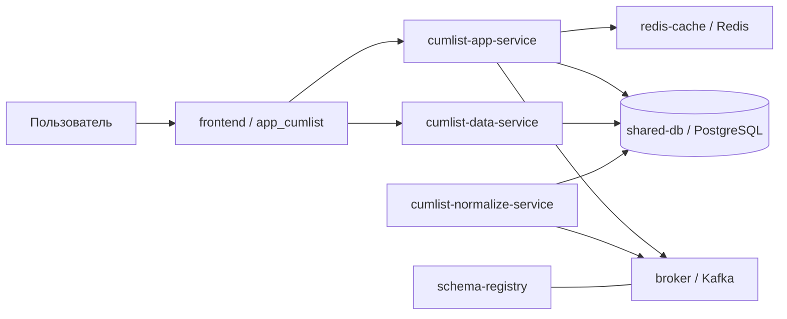
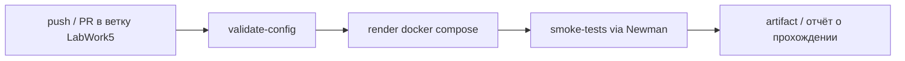

# Лабораторная работа №5  
**Тема:** реализация архитектуры на основе сервисов (микросервисной архитектуры)  
**Проект:** модуль **«Накопительная ведомость» (CumList / НВ)**

## 1. Цель работы

Получить опыт контейнеризации взаимодействующих сервисов Docker, настроить непрерывную интеграцию для сборки образов и подключить интеграционные тесты к CI.

В качестве основы использован реальный проект НВ:

- frontend: `automatic-dispatch-frontend`;
- backend-командный сервис: `cumlist-app-service`;
- backend-сервис чтения: `DEL_cumlist-data-service`;
- backend-сервис нормализации: `cumlist-normalize-service`;
- DevOps-артефакты: шаблоны CI, Helm charts, настройки Ansible/Terraform и локальные compose-файлы.

## 2. Исходные артефакты, на которые опирается решение

В реальном проекте уже присутствуют отдельные служебные конфигурации:

- у `cumlist-app-service`, `cumlist-data-service` и `cumlist-normalize-service` есть собственные `local/docker-compose.yml`, но они поднимают **только один сервис**, ожидая внешние зависимости `shared-db`, `broker`, `schema-registry`, `redis-cache`;
- у frontend есть `Dockerfile`, `nginx.conf`, а сборка статических файлов описана через DevOps-шаблон `build-static/static`;
- GitLab CI сервисов подключает reusable-компоненты `service/backend` и `service/frontend`, которые в свою очередь используют `build/kaniko`, `build-static/static`, рендер manifest-файлов и публикацию deployment-артефактов;
- для production-like развёртывания используются Helm charts `universal-backend` и `universal-frontend`, а также инфраструктурные репозитории `development` и `infra`.

Именно поэтому для лабораторной был подготовлен **единый локальный стенд**, который объединяет реальные сервисы проекта НВ и дополняет их недостающей инфраструктурой.

## 3. Контейнерная схема лабораторного стенда

В лабораторной реализации выделены следующие контейнеры.

| Контейнер | Назначение |
|---|---|
| `frontend` | клиентская часть НВ на React, раздаётся через nginx |
| `cumlist-data-service` | GraphQL API чтения карточек НВ и начислений |
| `cumlist-app-service` | GraphQL API команд: подписание, отклонение, операции по документу |
| `cumlist-normalize-service` | сервис асинхронной нормализации и обработки обновлений |
| `shared-db` | PostgreSQL с данными нормализованных документов |
| `broker` | Kafka broker для асинхронного обмена сообщениями |
| `schema-registry` | registry для Kafka-схем |
| `redis-cache` | Redis для подписок / кэша / служебного взаимодействия |
| `zookeeper` | служебный контейнер для Kafka в локальном стенде |

Таким образом, требование задания «минимум 3 контейнера: клиентская часть, серверная часть и БД» не только выполнено, но и расширено до стенда, близкого к реальной архитектуре НВ.

## 4. Взаимодействие контейнеров

### Логика обмена

1. Пользователь открывает UI модуля НВ.
2. UI получает данные карточек и списков через `cumlist-data-service`.
3. Командные действия (`подписать`, `отклонить`) уходят в `cumlist-app-service`.
4. `cumlist-app-service` взаимодействует с БД, Kafka и Redis.
5. `cumlist-normalize-service` обрабатывает поток обновлений и поддерживает нормализованное представление данных.
6. PostgreSQL является общей точкой хранения данных для чтения и служебной обработки.

## 5. Реализация Docker-стенда

Для лабораторной подготовлен единый файл:

- `src/lab/docker-compose.lab5.yml`

В отличие от исходных локальных compose-файлов отдельных сервисов, здесь в одном месте собраны:

- frontend;
- три backend-сервиса НВ;
- PostgreSQL;
- Kafka + Zookeeper;
- Schema Registry;
- Redis.

### Почему потребовался отдельный compose

Исходные `local/docker-compose.yml` из backend-репозиториев содержат только сервис уровня приложения и указывают на внешние имена инфраструктуры:

- `shared-db`
- `broker`
- `schema-registry`
- `redis-cache`

Для лабораторной работы это неудобно, потому что преподавателю нужно показать **запуск всего приложения**, а не одного контейнера в изоляции. Поэтому был собран **агрегирующий compose**, который повторяет реальные зависимости проекта и делает их явными.

### Переменные окружения

В `src/lab/.env.example` вынесены:

- публикуемые порты сервисов;
- учётные данные PostgreSQL;
- параметры GraphQL-клиента normalize-service;
- пути до соседних репозиториев для локальной сборки образов.

## 6. Сборка контейнеров

Для сборки подготовлен скрипт:

- `src/lab/build-images.sh`

Скрипт делает следующее:

1. Собирает frontend:
   - выполняет `pnpm install`;
   - копирует `deploy/develop/env` в `.env.production` приложения `app_cumlist`;
   - запускает `pnpm --filter app_cumlist run build`;
   - формирует папку `artifacts/apps_cumlist`;
   - собирает nginx-образ frontend.
2. Собирает:
   - `cumlist-app-service`;
   - `cumlist-data-service`;
   - `cumlist-normalize-service`.

### Важное ограничение

Оригинальные Dockerfile и NuGet / npm-конфигурации используют внутренние корпоративные ресурсы:

- `auriga-repo.nts.local`;
- приватный NuGet feed `nexus-nuget-nts`;
- приватный npm registry.

Из-за этого полностью воспроизвести сборку можно только при доступе к корпоративной инфраструктуре. Это не недостаток лабораторной реализации, а особенность исходного проекта. В отчёте это важно зафиксировать честно.

## 7. Непрерывная интеграция

В реальных репозиториях CI реализован через GitLab reusable components:

- `service/backend`
- `service/frontend`
- `build/kaniko`
- `build-static/static`
- `unit-tests`

Для лабораторной работы подготовлена **адаптация под GitHub Actions**:

- `src/lab/github-actions/lab5-ci.yml`

### Что делает лабораторный CI

1. Проверяет синтаксис `docker-compose.lab5.yml`.
2. Публикует отрендеренный compose как artifact.
3. Запускает интеграционные smoke-тесты через Newman.

Смысл такой адаптации:

- лабораторный репозиторий по требованиям преподавателя хранится на GitHub;
- реальный проект использует GitLab CI;
- поэтому в лабораторной зафиксирована понятная GitHub-реализация, но сама логика пайплайна повторяет реальный подход проекта: **сборка → валидация → тестирование**.

### Mermaid-схема CI

## 8. Интеграционные тесты

В `src/lab/tests` подготовлены два варианта тестирования.

### 8.1. Базовые smoke-тесты

Файлы:

- `CumList Smoke Tests.postman_collection.json`
- `CumList Smoke Tests.postman_environment.json`
- `run-newman.sh`

Проверяются:

- доступность frontend (`/app_cumlist/`);
- `healthz` у `cumlist-data-service`;
- `healthz` у `cumlist-app-service`;
- `healthz` у `cumlist-normalize-service`.

Это именно **интеграционные smoke-тесты**, потому что они запускаются против уже поднятого контейнерного стенда и проверяют связный набор сервисов, а не отдельные unit-тесты.

### 8.2. Повторное использование тестов из 4-й лабораторной

Дополнительно в папку:

- `src/lab/tests/optional-graphql-regression`

скопирована GraphQL Postman-коллекция из лабораторной №4. Её можно прогонять поверх того же стенда после подготовки тестовых данных в PostgreSQL. Это соответствует формулировке задания, где прямо разрешено использовать ранее созданные тесты Postman.

## 9. Непрерывное развертывание

Для повышенной сложности подготовлен шаблон:

- `src/lab/github-actions/lab5-cd.yml`

Он оформлен как проектный каркас под публикацию образов в Docker Hub / registry.

Почему именно шаблон, а не полностью автоматический deploy:

- лабораторный репозиторий содержит артефакты и конфигурации, а не все боевые исходники сервисов;
- реальный проект разворачивается через Helm charts `universal-backend` / `universal-frontend`, Ansible и инфраструктурные репозитории;
- поэтому в лабораторной работе корректнее показать **структуру CD-пайплайна**, а не изображать фиктивное полнофункциональное развёртывание.

## 10. Что в итоге реализовано

По требованиям задания в лабораторной №5 выполнено следующее:

1. Подготовлен контейнерный стенд из нескольких взаимодействующих сервисов:
   - клиентская часть;
   - серверная часть;
   - БД;
   - Kafka;
   - Schema Registry;
   - Redis.
2. Собран единый `docker-compose` для локального запуска.
3. Подготовлен скрипт сборки Docker-образов на основе реальных репозиториев проекта.
4. Настроен CI-шаблон для GitHub Actions.
5. Подготовлены интеграционные smoke-тесты и включение их в CI.
6. Подготовлен шаблон CD для публикации образов.

## 11. Вывод

Лабораторная работа №5 выполнена на материале реального проекта **«Накопительная ведомость»**. В отличие от учебной упрощённой схемы, здесь показан стенд, близкий к промышленной архитектуре:

- frontend;
- командный и читающий backend;
- сервис нормализации;
- PostgreSQL;
- Kafka;
- Schema Registry;
- Redis.

За счёт этого результат выглядит не как абстрактный пример Docker Compose, а как осмысленная реализация сервисного взаимодействия под конкретный модуль НВ.
