# Лабораторная работа №6
**Тема:** использование шаблонов проектирования  
**Проект:** модуль **«Накопительная ведомость» (CumList / НВ)**

## Цель работы

Получить опыт применения шаблонов проектирования при написании кода программной системы.

## Исходная база проекта

В качестве основы взят реальный код проекта НВ:

- frontend: `automatic-dispatch-frontend`;
- командный backend: `cumlist-app-service`;
- read-model backend: `DEL_cumlist-data-service`;
- normalize-service: `cumlist-normalize-service`;
- общие библиотеки: `NTS.GraphQL`, `NTS.Kafka`, `NTS.Database`, `NTS.Redis`.

Для лабораторной использованы **два уровня материала**:

1. **Реальные production-фрагменты**, уже присутствующие в проекте:
   - `NormalizedDocTypeFactory.cs` и `NormalizeDocTypeFactory.cs`;
   - `BaseOperationCumListHandler.cs`, `SignOperationCumListHandler.cs`, `RejectOperationCumListHandler.cs`;
   - `CumListOperationsTopicHandler.cs`;
   - `getGraphQLWhereFilters.ts`;
   - `useCumListSubscription.tsx`.
2. **Учебный мини-проект `CumList.DesignPatterns`**, где те же идеи оформлены явно и компактно, чтобы показать GoF и GRASP без лишнего шума инфраструктурного кода.

Каталог лабораторной:

- отчёт: `Lab Work №6/docs/LabWork6.md`;
- код: `Lab Work №6/src/CumList.DesignPatterns`;
- production-референсы: `Lab Work №6/src/CumList.DesignPatterns/Reference/ActualProject`.

---

# Шаблоны проектирования GoF

## Порождающие шаблоны

### 1. Factory Method — фабрика обработчиков операций НВ

**Общее назначение.** Инкапсулировать создание семейства объектов, зависящих от типа операции.  
**Назначение в НВ.** По действию пользователя (`подписать` / `отклонить`) выбирать нужный обработчик, не заставляя вызывающий код знать детали payload’а для интеграционного модуля.

**Где это видно в реальном проекте.** В production-коде уже есть фабрики типов документов:
- `Reference/ActualProject/AppService/NormalizedDocTypeFactory.cs`;
- `Reference/ActualProject/NormalizeService/NormalizeDocTypeFactory.cs`.

**Лабораторная реализация.** `src/CumList.DesignPatterns/Creational/OperationHandlerFactory.cs`

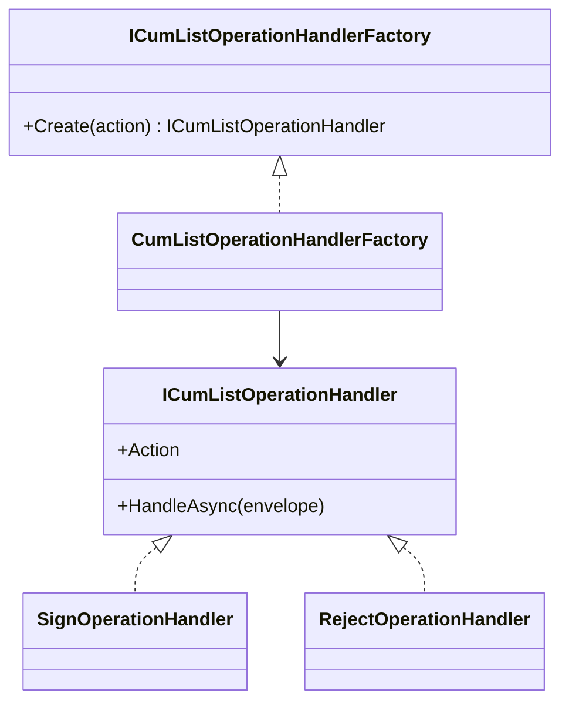

```csharp
public sealed class CumListOperationHandlerFactory : ICumListOperationHandlerFactory
{
    private readonly IReadOnlyDictionary<CumListAction, ICumListOperationHandler> _handlers;

    public CumListOperationHandlerFactory(IEnumerable<ICumListOperationHandler> handlers)
    {
        _handlers = handlers.ToDictionary(handler => handler.Action);
    }

    public ICumListOperationHandler Create(CumListAction action)
        => _handlers.TryGetValue(action, out var handler)
            ? handler
            : throw new InvalidOperationException();
}
```

**Результат.** Добавление новой операции (`подписать с разногласиями`, `повторная отправка`) не ломает вызывающий код: достаточно зарегистрировать новый обработчик.

---

### 2. Builder — построитель GraphQL-фильтра для журнала НВ

**Общее назначение.** По шагам собирать сложный объект, отделяя процесс построения от конечного представления.  
**Назначение в НВ.** Формировать вложенный `where` для GraphQL с учётом фильтров по состоянию, станции, плательщику и вложенных групп `and`/`or`.

**Связь с реальным проектом.** Во frontend уже есть логика формирования `where` в `Reference/ActualProject/Frontend/getGraphQLWhereFilters.ts`. В лабораторной этот сценарий оформлен явным Builder.

**Лабораторная реализация.** `src/CumList.DesignPatterns/Creational/CumListFilterBuilder.cs`

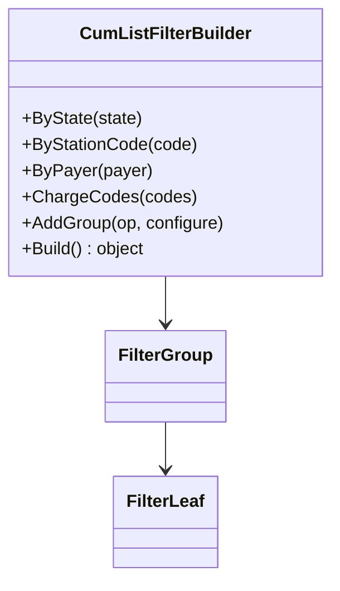

```csharp
public CumListFilterBuilder AddGroup(LogicalOperator logicalOperator, Action<CumListFilterBuilder> configure)
{
    var nestedBuilder = new CumListFilterBuilder(logicalOperator);
    configure(nestedBuilder);
    _root.Add(nestedBuilder.BuildNode());
    return this;
}
```

**Результат.** UI-код не собирает JSON/GraphQL вручную; сложный фильтр строится последовательно и читаемо.

---

### 3. Prototype — копирование шаблона фильтра и представления таблицы

**Общее назначение.** Создавать новый объект клонированием уже существующего экземпляра.  
**Назначение в НВ.** Пользователь сохраняет шаблон фильтра и затем создаёт его копию под другую роль/сценарий без ручной пересборки столбцов и групп условий.

**Лабораторная реализация.** `src/CumList.DesignPatterns/Creational/FilterTemplatePrototype.cs`

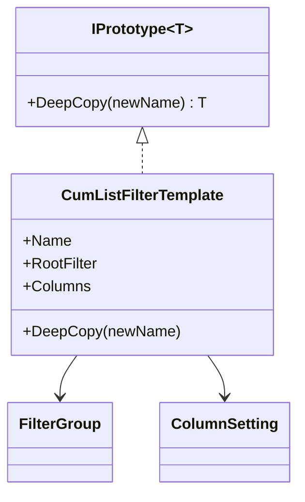

```csharp
public CumListFilterTemplate DeepCopy(string? newName = null)
{
    return new CumListFilterTemplate(
        newName ?? $"{Name} (copy)",
        (FilterGroup)RootFilter.DeepCopy(),
        Columns.Select(column => column with { }).ToArray());
}
```

**Результат.** Копирование шаблона становится дешёвой операцией, а исходный шаблон остаётся неизменным.

---

## Структурные шаблоны

### 4. Adapter — адаптер ответа внешней интеграции (ETRAN / integration module)

**Общее назначение.** Преобразовать несовместимый интерфейс внешнего компонента к внутреннему интерфейсу приложения.  
**Назначение в НВ.** Внешняя система возвращает статус в своём формате, а клиентскому и серверному коду НВ нужен внутренний `InternalOperationResult`.

**Лабораторная реализация.** `src/CumList.DesignPatterns/Structural/EtranReplyAdapter.cs`

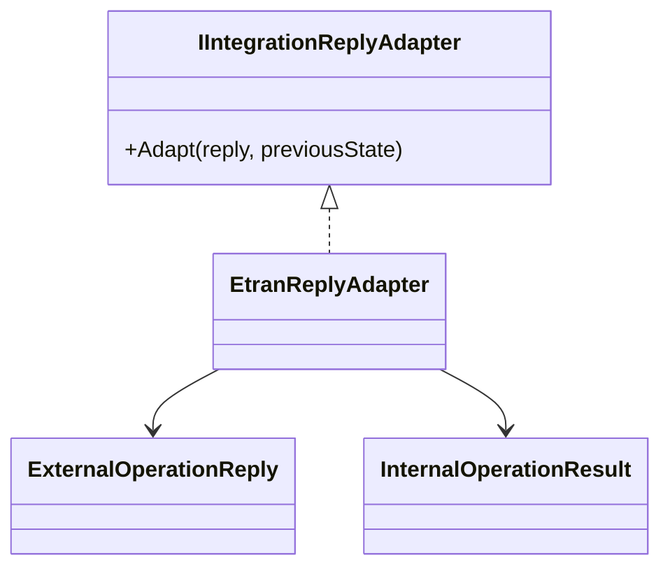

```csharp
public InternalOperationResult Adapt(ExternalOperationReply reply, string previousState)
{
    if (reply.Status == "Accepted")
        return new InternalOperationResult(true, reply.ExternalState ?? "Подписан", null, null);

    if (reply.Status == "Rejected")
        return new InternalOperationResult(false, previousState, "ETRAN_REJECTED", reply.ErrorText);

    return new InternalOperationResult(false, previousState, "ETRAN_UNKNOWN", "Неизвестный ответ");
}
```

**Результат.** Внешний формат ответа изолирован. При смене интеграционного контракта переписывается адаптер, а не весь доменный код.

---

### 5. Facade — фасад загрузки карточки НВ

**Общее назначение.** Предоставить упрощённый интерфейс к набору подсистем.  
**Назначение в НВ.** Карточка НВ состоит из документа, истории, правил и связанных документов. UI не должен знать, к какому репозиторию идти за каждой частью.

**Лабораторная реализация.** `src/CumList.DesignPatterns/Structural/CumListCardFacade.cs`

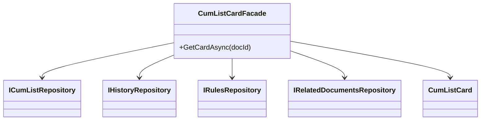

```csharp
public async Task<CumListCard> GetCardAsync(long docId, CancellationToken cancellationToken = default)
{
    var document = await cumListRepository.GetByIdAsync(docId, cancellationToken)
        ?? throw new InvalidOperationException($"CumList {docId} not found.");

    var history = await historyRepository.GetHistoryAsync(docId, cancellationToken);
    var rules = await rulesRepository.GetRulesAsync(docId, cancellationToken);
    var relatedDocuments = await relatedDocumentsRepository.GetRelatedDocumentsAsync(docId, cancellationToken);

    return new CumListCard(document, history, rules, relatedDocuments);
}
```

**Результат.** Клиентский слой и контроллеры опираются на одну точку входа. Изменения состава карточки локализованы в фасаде.

---

### 6. Composite — дерево вложенных фильтров

**Общее назначение.** Позволить работать с одиночными объектами и их композициями единообразно.  
**Назначение в НВ.** Глобальный фильтр включает как простые условия (`state = На подписи`), так и группы условий `and/or` с вложенностью.

**Связь с реальным проектом.** Production-логика вложенных фильтров уже есть во frontend-файле `Reference/ActualProject/Frontend/getGraphQLWhereFilters.ts`.

**Лабораторная реализация.** `src/CumList.DesignPatterns/Structural/FilterComposite.cs`

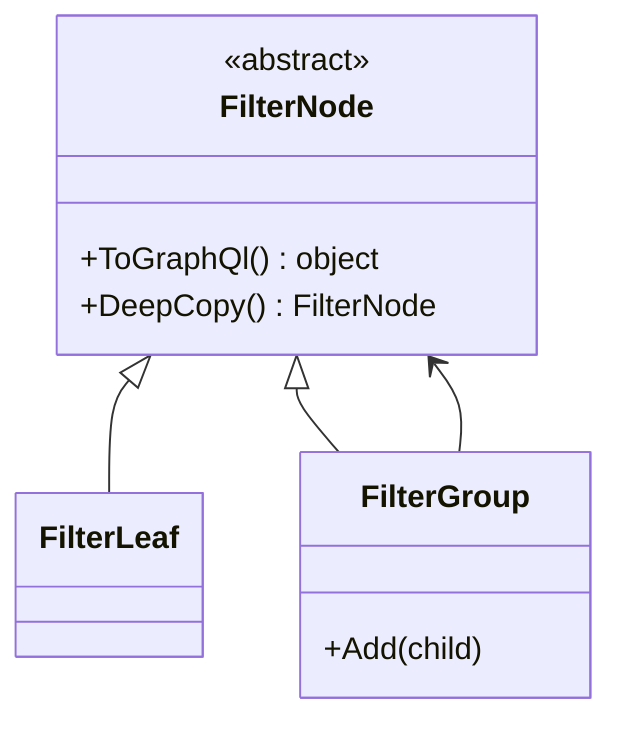

```csharp
public sealed class FilterGroup(LogicalOperator @operator) : FilterNode
{
    private readonly List<FilterNode> _children = [];

    public void Add(FilterNode child) => _children.Add(child);

    public override object ToGraphQl() => new Dictionary<string, object?>
    {
        [Operator == LogicalOperator.And ? "and" : "or"] = _children.Select(x => x.ToGraphQl()).ToArray()
    };
}
```

**Результат.** Один и тот же код умеет работать и с листом фильтра, и с группой фильтров. Это особенно важно для nested-формата, который уже используется в НВ.

---

### 7. Decorator — кэширование и логирование чтения карточки НВ

**Общее назначение.** Динамически расширять поведение объекта, не меняя его исходный класс.  
**Назначение в НВ.** Поверх стандартного сервиса чтения карточки добавляются кэширование и аудит доступа.

**Лабораторная реализация.** `src/CumList.DesignPatterns/Structural/CachedCumListCardServiceDecorator.cs`

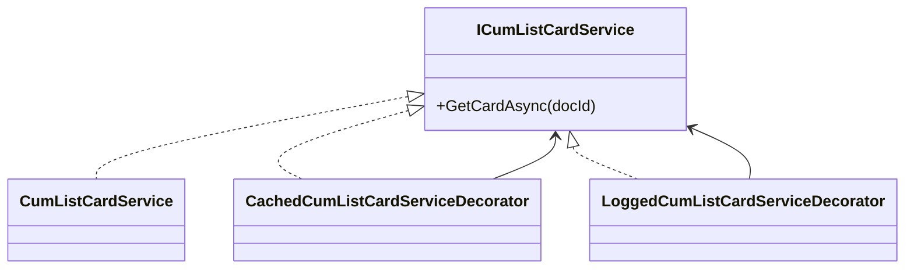

```csharp
public sealed class CachedCumListCardServiceDecorator(ICumListCardService inner, ICacheStore cache) : ICumListCardService
{
    public Task<CumListCard> GetCardAsync(long docId, CancellationToken cancellationToken = default)
    {
        var key = $"cumlist-card:{docId}";
        if (cache.TryGet<CumListCard>(key, out var cached) && cached is not null)
            return Task.FromResult(cached);

        return LoadAndCacheAsync(key, docId, cancellationToken);
    }
}
```

**Результат.** Кэш и логирование подключаются независимо и стекаются друг на друга, не усложняя базовый сервис чтения.

---

## Поведенческие шаблоны

### 8. Command — команды `подписать` и `отклонить`

**Общее назначение.** Инкапсулировать запрос как объект.  
**Назначение в НВ.** Действия пользователя над документом превращаются в отдельные команды, которые можно запускать, логировать, повторять и тестировать независимо.

**Связь с реальным проектом.** Production-версия этой идеи видна в связке `Mutation.cs` + обработчики `SignOperationCumListHandler` и `RejectOperationCumListHandler`.

**Лабораторная реализация.** `src/CumList.DesignPatterns/Behavioral/CumListCommands.cs`

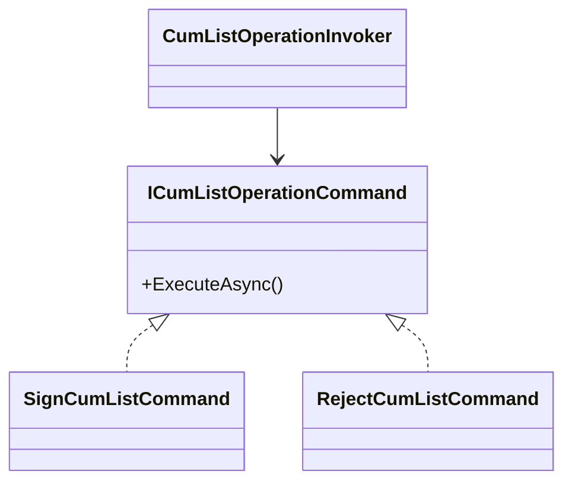

```csharp
public sealed class SignCumListCommand(...) : ICumListOperationCommand
{
    public async Task ExecuteAsync(CancellationToken cancellationToken = default)
    {
        var request = await handlerFactory.Create(CumListAction.Sign).HandleAsync(envelope, cancellationToken);
        await operationBus.EnqueueAsync(request, cancellationToken);
        await audit.RegisterAsync(envelope.DocId, "Sign", "Pending", envelope.UserId, envelope.CorrelationId, cancellationToken);
    }
}
```

**Результат.** UI и application-service больше не знают о деталях публикации в Kafka или формировании payload.

---

### 9. Strategy — стратегии формирования payload для интеграционного модуля

**Общее назначение.** Выделить взаимозаменяемые алгоритмы и выбирать нужный во время выполнения.  
**Назначение в НВ.** Для `подписать` и `отклонить` требуется разный JSON payload, хотя внешний контракт один и тот же.

**Лабораторная реализация.** `src/CumList.DesignPatterns/Behavioral/OperationRequestStrategy.cs`

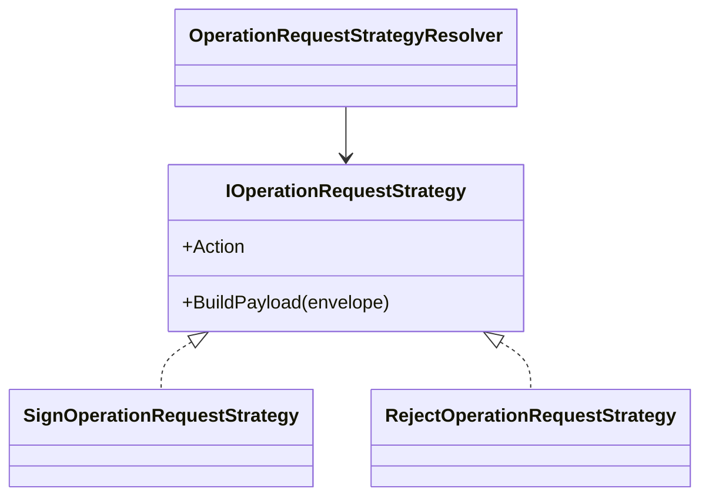

```csharp
public sealed class RejectOperationRequestStrategy : IOperationRequestStrategy
{
    public CumListAction Action => CumListAction.Reject;

    public string BuildPayload(OperationEnvelope envelope)
        => $$"{\"action\":2,\"discordId\":{{envelope.RejectReasonId ?? 0}},\"discordText\":\"{{envelope.RejectComment ?? string.Empty}}\"}";
}
```

**Результат.** Формирование запроса перестаёт быть набором `if/else`, а новые операции можно добавить через новую стратегию.

---

### 10. Observer — подписка на изменение состояния документа

**Общее назначение.** Определить зависимость «один-ко-многим», чтобы наблюдатели автоматически реагировали на изменение состояния субъекта.  
**Назначение в НВ.** После ответа интеграционного модуля нужно обновить карточку, показать уведомление и, при необходимости, сбросить кэш.

**Связь с реальным проектом.** В production-frontend эту роль выполняют GraphQL-subscriptions: `Reference/ActualProject/Frontend/useCumListSubscription.tsx`. На сервере публикация результата идёт из `Reference/ActualProject/AppService/CumListOperationsTopicHandler.cs`.

**Лабораторная реализация.** `src/CumList.DesignPatterns/Behavioral/DocumentStateChangedObserver.cs`

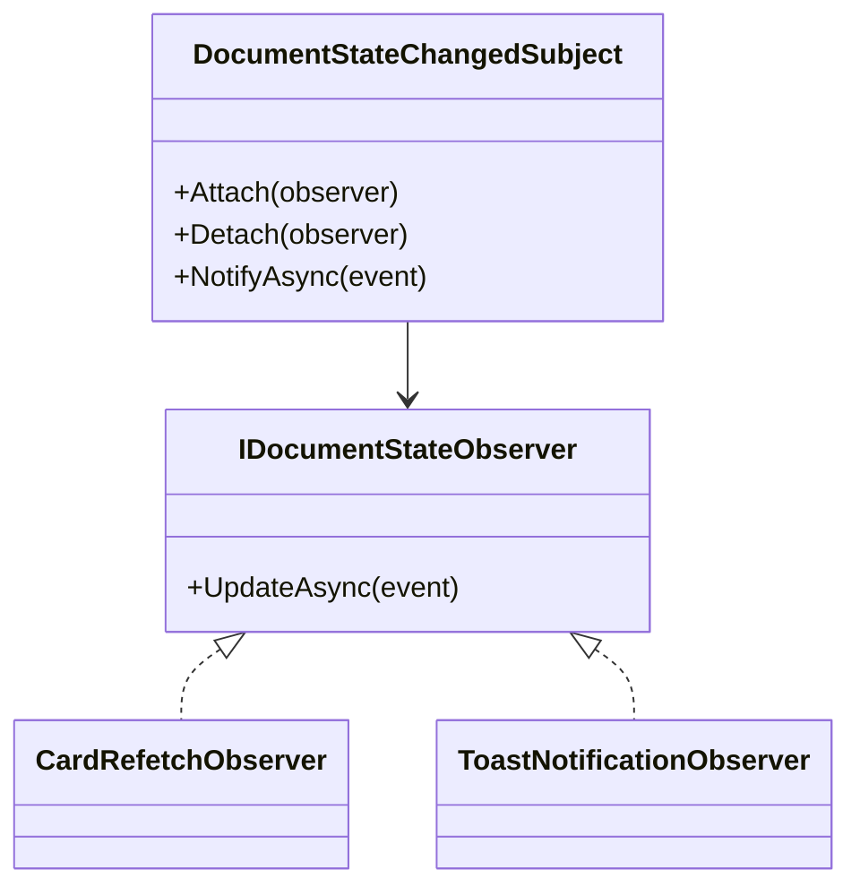

```csharp
public sealed class DocumentStateChangedSubject
{
    private readonly List<IDocumentStateObserver> _observers = [];

    public async Task NotifyAsync(DocumentStateChanged @event, CancellationToken cancellationToken = default)
    {
        foreach (var observer in _observers)
            await observer.UpdateAsync(@event, cancellationToken);
    }
}
```

**Результат.** Реакция на событие расширяется без переписывания издателя: можно добавить новый observer для Excel-выгрузки, кэша или веб-сокет-уведомления.

---

### 11. State — состояния документа НВ

**Общее назначение.** Менять поведение объекта при изменении внутреннего состояния.  
**Назначение в НВ.** Документ ведёт себя по-разному в состояниях `На подписи`, `Выполнение операции`, `Подписан`, `Отклонён`.

**Лабораторная реализация.** `src/CumList.DesignPatterns/Behavioral/CumListStateMachine.cs`

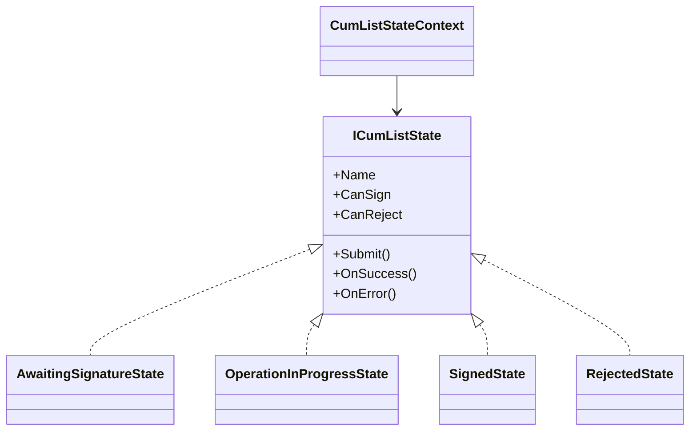

```csharp
public sealed class OperationInProgressState(ICumListState previousState) : ICumListState
{
    public string Name => "Выполнение операции";
    public bool CanSign => false;
    public bool CanReject => false;
    public ICumListState Submit() => this;
    public ICumListState OnSuccess() => new SignedState();
    public ICumListState OnError() => previousState;
}
```

**Результат.** Правила доступности кнопок и переходов не размазываются по UI и backend-валидаторам, а концентрируются в одном месте.

---

### 12. Template Method — базовый алгоритм обработки операции над документом

**Общее назначение.** Зафиксировать общий алгоритм, делегировав изменяемые шаги подклассам.  
**Назначение в НВ.** Для `подписать` и `отклонить` общий pipeline одинаков: загрузить документ, проверить допустимость, подготовить запрос, зафиксировать ожидание, отправить сообщение и уведомить подписчиков.

**Связь с реальным проектом.** В production-коде это очень похоже на `Reference/ActualProject/AppService/BaseOperationCumListHandler.cs` и его наследников.

**Лабораторная реализация.** `src/CumList.DesignPatterns/Behavioral/BaseOperationProcessor.cs`

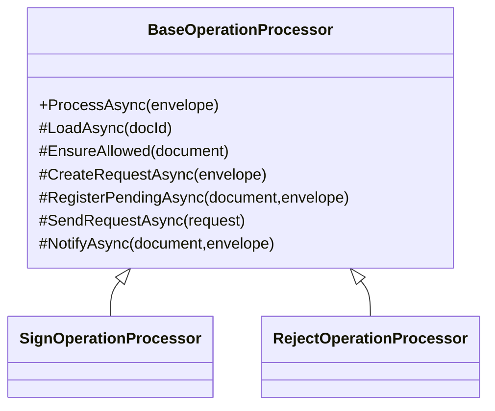

```csharp
public async Task<InternalOperationResult> ProcessAsync(OperationEnvelope envelope, CancellationToken cancellationToken = default)
{
    var document = await LoadAsync(envelope.DocId, cancellationToken);
    EnsureAllowed(document);

    var request = await CreateRequestAsync(envelope, cancellationToken);
    await RegisterPendingAsync(document, envelope, cancellationToken);
    await SendRequestAsync(request, cancellationToken);
    await NotifyAsync(document, envelope, cancellationToken);

    return new InternalOperationResult(true, "Выполнение операции", null, null);
}
```

**Результат.** Повторяющаяся логика не дублируется в обработчиках разных операций, а отличия локализованы в переопределяемых шагах.

---

# Шаблоны проектирования GRASP

## Роли (обязанности) классов

### 1. Controller — `CumListOperationsController`

**Проблема.** Нельзя заставлять UI или транспортный слой напрямую управлять жизненным циклом команд.  
**Решение.** Выделить объект-контроллер, который принимает пользовательский запрос и передаёт его инвокеру команд.  
**Код.** `src/CumList.DesignPatterns/Grasp/GraspExamples.cs`

```csharp
public sealed class CumListOperationsController(CumListOperationInvoker invoker)
{
    public Task SignAsync(ICumListOperationCommand command, CancellationToken cancellationToken = default)
        => invoker.ExecuteAsync(command, cancellationToken);
}
```

**Результат.** UI не знает о Kafka, аудитах и payload’ах.  
**Связь.** Controller хорошо сочетается с Command и Facade.

---

### 2. Creator — `FilterTemplateCreator`

**Проблема.** Нужно определить, кто создаёт шаблон фильтра.  
**Решение.** Создание передаётся классу, который знает состав шаблона и его начальные колонки/группы.  
**Код.**

```csharp
public static class FilterTemplateCreator
{
    public static CumListFilterTemplate CreateDefaultForSigning(FilterGroup rootFilter)
        => new("На подпись сегодня", rootFilter, [new ColumnSetting("docId", true, 0)]);
}
```

**Результат.** Создание объекта находится рядом с его знанием по умолчанию.  
**Связь.** Creator усиливает Prototype и Builder.

---

### 3. Information Expert — `CumListRulesExpert` / объект состояния документа

**Проблема.** Кто должен знать, нужна ли причина отклонения и доступны ли операции?  
**Решение.** Ответственность передаётся объекту, у которого есть нужная информация: либо экспертному сервису правил, либо объекту состояния документа.  
**Код.**

```csharp
public static class CumListRulesExpert
{
    public static bool RequiresRejectReason(CumListAction action) => action == CumListAction.Reject;
}
```

**Результат.** Бизнес-правила не размазываются по контроллерам и UI.  
**Связь.** Information Expert естественно связан с State и Strategy.

---

### 4. Pure Fabrication — `EtranReplyAdapter`

**Проблема.** Нужен класс, который не принадлежит напрямую предметной области, но помогает не загрязнять доменные сущности интеграционными деталями.  
**Решение.** Создать искусственный служебный класс-адаптер.  
**Код.** `Structural/EtranReplyAdapter.cs`.

**Результат.** Доменные сущности НВ не знают о формате reply внешней системы.  
**Связь.** Pure Fabrication часто реализуется через Adapter, Facade, Repository.

---

### 5. Polymorphism — семейства команд, стратегий и состояний

**Проблема.** Нельзя расписывать обработку операций через длинные `switch`/`if`.  
**Решение.** Поведение делегируется полиморфным объектам: командам, стратегиям и состояниям.  
**Код.**

```csharp
public interface ICumListOperationCommand
{
    Task ExecuteAsync(CancellationToken cancellationToken = default);
}
```

**Результат.** Расширение модуля новыми операциями не требует модификации старых ветвлений.  
**Связь.** Polymorphism напрямую связан с Factory Method, Strategy, State, Template Method.

---

## Принципы разработки

### 1. Low Coupling — слабая связанность

**Проблема.** Если UI, GraphQL, интеграция, кэш и аудит жёстко сцеплены, любое изменение ломает несколько слоёв сразу.  
**Решение.** Использовать интерфейсы (`ICumListCardService`, `ICumListRepository`, `IIntegrationReplyAdapter`, `IOperationBus`) и передавать зависимости через конструкторы.  
**Пример кода.**

```csharp
public sealed class CumListCardFacade(
    ICumListRepository cumListRepository,
    IHistoryRepository historyRepository,
    IRulesRepository rulesRepository,
    IRelatedDocumentsRepository relatedDocumentsRepository)
```

**Результат.** Сервис карточки можно тестировать отдельно, а источник данных или кэш подменять без переписывания фасада.  
**Связь.** Усиливается через Facade, Adapter, Strategy, Decorator.

---

### 2. High Cohesion — высокая связность обязанностей внутри класса

**Проблема.** Когда один класс и фильтры строит, и payload генерирует, и карточку грузит, и нотификации рассылает, код быстро становится неустойчивым.  
**Решение.** Разделить классы по ролям: `CumListFilterBuilder`, `CumListCardFacade`, `EtranReplyAdapter`, `DocumentStateChangedSubject`, `BaseOperationProcessor`.  
**Пример кода.** `CumListCardFacade` отвечает только за композицию карточки, а не за отправку операций.

**Результат.** Классы компактнее, проще читать и тестировать.  
**Связь.** High Cohesion дополняет Low Coupling и хорошо поддерживается Command/Facade.

---

### 3. Indirection — косвенность

**Проблема.** Прямой вызов внешней системы и прямое знание о её формате делают код хрупким.  
**Решение.** Вводится дополнительный слой: `EtranReplyAdapter`, `CumListCardFacade`, `OperationRequestStrategyResolver`.  
**Пример кода.**

```csharp
public sealed class CumListIntegrationFacade(
    IIntegrationReplyAdapter adapter,
    ICumListOperationHandlerFactory handlerFactory)
```

**Результат.** Изменения в интеграционном контракте локализуются в промежуточном слое.  
**Связь.** Indirection часто реализуется вместе с Adapter, Facade и Factory.

---

## Свойство программы (цель)

### Protected Variations — защита от изменчивости внешних контрактов

**Проблема.** Для НВ меняются по крайней мере три класса вещей:  
1. формат интеграционного ответа;  
2. JSON payload для разных операций;  
3. GraphQL-представление фильтров.

**Решение.** Нестабильные точки изолируются за стабильными интерфейсами и объектами:

- `EtranReplyAdapter` — защищает доменную модель от вариаций reply;
- `IOperationRequestStrategy` — защищает вызов команд от изменений payload;
- `CumListFilterBuilder` + `FilterComposite` — защищают UI от ручной сборки nested-структур.

**Пример кода.**

```csharp
public interface IOperationRequestStrategy
{
    CumListAction Action { get; }
    string BuildPayload(OperationEnvelope envelope);
}
```

**Результат.** Изменение внешнего контракта не требует массового переписывания приложения.  
**Связь.** Protected Variations особенно хорошо поддерживается через Strategy, Adapter, Facade, Factory Method.

---

# Выводы

В лабораторной работе для проекта **«Накопительная ведомость»** были показаны:

- **3 порождающих шаблона**: Factory Method, Builder, Prototype;
- **4 структурных шаблона**: Adapter, Facade, Composite, Decorator;
- **5 поведенческих шаблонов**: Command, Strategy, Observer, State, Template Method.

Также выполнен анализ по **GRASP**:

- **5 ролей/обязанностей классов**: Controller, Creator, Information Expert, Pure Fabrication, Polymorphism;
- **3 принципа разработки**: Low Coupling, High Cohesion, Indirection;
- **1 свойство программы**: Protected Variations.

Итоговый подход соответствует архитектуре реального модуля НВ: операции `подписать/отклонить`, GraphQL-подписки, nested-фильтры, карточка документа и интеграция с внешним модулем стали основой для выбора паттернов. За счёт этого лабораторная не является абстрактным набором примеров, а напрямую связана с предметной областью и кодовой базой проекта.
